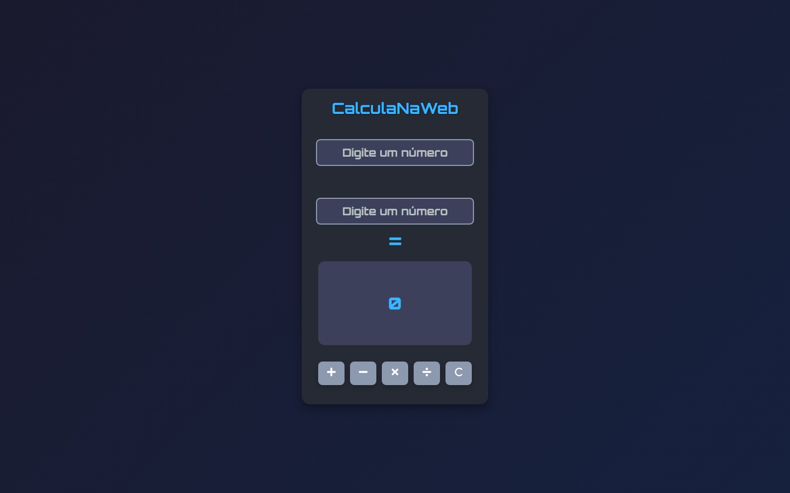
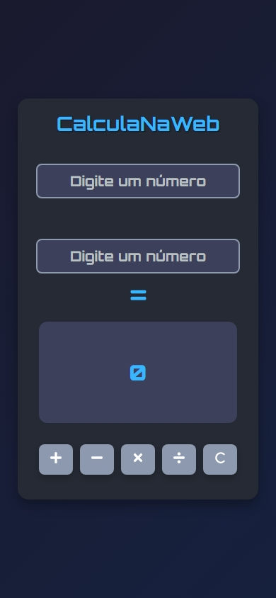

# CalculaNaWeb 🧮

Uma calculadora web simples e elegante construída com React e Sass. Este projeto oferece operações matemáticas básicas com uma interface limpa e responsiva.

## 📸 Screenshots

### Desktop
<p align="center">
  
</p>

### Mobile

<p align="center">
  
</p>

## 📋 Funcionalidades

- Operações matemáticas básicas:
  - Adição ➕
  - Subtração ➖
  - Multiplicação ✖️
  - Divisão ➗
- Função de limpar para resetar cálculos
- Design responsivo para todos os tamanhos de dispositivos
- Visualização em tempo real das operações
- Formatação do resultado com 2 casas decimais
- Validação de entrada para valores numéricos

## 🚀 Tecnologias Utilizadas

- React.js
- Sass
- React Icons

## 💻 Como Funciona

A calculadora aceita dois valores numéricos e realiza a operação selecionada ao clicar no botão do operador correspondente. O resultado é exibido automaticamente com a formatação adequada.

### Operações Disponíveis:
1. Adição (`+`): Soma dois números
2. Subtração (`-`): Subtrai o segundo número do primeiro
3. Multiplicação (`×`): Multiplica dois números
4. Divisão (`÷`): Divide o primeiro número pelo segundo
5. Limpar (`C`): Reseta todos os valores e operações

## 🎯 Componentes Principais

- Dois campos de entrada numérica para os operandos
- Botões de operação com ícones intuitivos
- Campo de exibição do resultado (somente leitura)
- Indicador visual da operação
- Botão de limpar para resetar cálculos

## 📱 Interface do Usuário

A interface consiste em:
- Cabeçalho com título "CalculaNaWeb"
- Dois campos de entrada para números
- Botões de operação com React Icons
- Área de exibição do resultado
- Design responsivo que se adapta a diferentes tamanhos de tela

## 🛠️ Detalhes da Implementação

A calculadora é implementada usando o hook useState do React para gerenciamento de estado:
```javascript
const [primeiroValor, setPrimeiroValor] = useState('');
const [segundoValor, setSegundoValor] = useState('');
const [operador, setOperador] = useState('');
const [resultado, setResultado] = useState(0);
const [visible, setVisible] = useState("hidden");
```

### Implementação das Principais Funcionalidades:
- Conversão adequada de tipos para garantir que as operações matemáticas funcionem corretamente
- Alternância de visibilidade para indicadores de operação
- Formatação do resultado com 2 casas decimais
- Validação de entrada para garantir que apenas números sejam aceitos
- Funcionalidade de limpar para resetar todos os estados

## 🚦 Como Usar

1. Digite o primeiro número no primeiro campo de entrada
2. Digite o segundo número no segundo campo de entrada
3. Clique em um dos botões de operação (+, -, ×, ÷)
4. Veja o resultado exibido automaticamente abaixo
5. Use o botão Limpar (C) para resetar e começar um novo cálculo

## 🎨 Estilização

O projeto utiliza Sass para estilização, oferecendo:
- Interface limpa e moderna
- Design responsivo
- Feedback visual para interações do usuário
- Espaçamento e alinhamento consistentes
- Visibilidade clara das operações e resultados

## 🔧 Configuração e Instalação

1. Clone o repositório
```bash
git clone https://github.com/edimaiquemaciel/DesafioCalculadoraReact.git
```

2. Instale as dependências
```bash
npm install
```

3. Execute o servidor de desenvolvimento
```bash
npm run dev
```

## 📝 Observações

- Certifique-se de que ambos os campos de entrada tenham valores antes de realizar operações
- A calculadora lida apenas com operações aritméticas básicas
- Os resultados são formatados automaticamente com 2 casas decimais
- A interface foi projetada para ser intuitiva e fácil de usar

## 📄 Licença

Este projeto está licenciado sob a [MIT](https://choosealicense.com/licenses/mit/).
